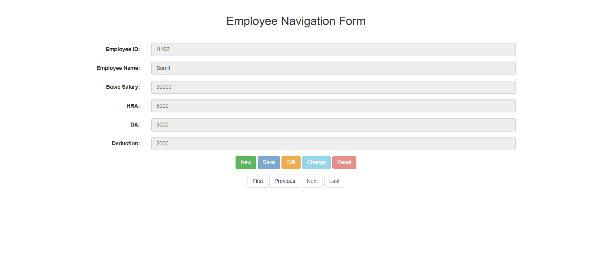

# 🚀 Employee Navigation Form with JPDB & SweetAlert 🎉

  
  
  
  
  
  

---

## ✨ Description

Welcome to the **Employee Navigation Form** project! This sleek web app combines the power of **JsonPowerDB (JPDB)** and **SweetAlert2** with a **Bootstrap** front end to create an intuitive, responsive interface for managing employee data effortlessly.

Enjoy instant feedback with elegant alerts and a smooth user experience!

---

## 🎯 Benefits of Using JsonPowerDB

- Cloud-hosted JSON database 🗄️
- Simple REST API access 🔗
- Fast prototyping without backend hassle ⚡
- Native JSON support for flexible data 📦
- Secure, token-based authentication 🔐

---

## 📅 Release History

| Version | Date       | Highlights                                 |
|---------|------------|--------------------------------------------|
| 1.0     | 2025-06-01 | Initial launch with CRUD & SweetAlert UI   |

---

## 🔧 Scope of Functionalities

- ✅ Add, edit, fetch employee records
- ✅ Interactive form controls based on data existence
- ✅ Beautiful, user-friendly alerts via SweetAlert2
- ✅ Responsive layout with Bootstrap 3
- ✅ Navigation buttons for record traversal

---

## 📸 Demo Preview

---

## 🛠 Examples of Use

- Search employee by ID with immediate form update.
- Create new employee entries when ID is unique.
- Edit and save updates with validation feedback.
- Seamless error handling and success confirmation.

---

## 🚧 Project Status

Active development — core features are stable; navigation enhancements and additional data validations coming soon!

---

## 📚 Sources & References

- [JsonPowerDB Docs](https://login2explore.com/jpdb/docs.html)
- [SweetAlert2](https://sweetalert2.github.io/)
- [Bootstrap 3 Docs](https://getbootstrap.com/docs/3.4/)
- [jQuery API](https://api.jquery.com/)

---

## ℹ️ Other Information

Learn more about creating excellent READMEs:

- [Mastering Markdown Guide](https://guides.github.com/features/mastering-markdown/)
- Inspiring examples:
  - https://github.com/dbader/readme-template
  - https://github.com/amitmerchant1990/electron-markdownify#readme
  - https://github.com/BeAgarwal/JsonPowerDB#readme

---

## 📬 Contact

Himanshu Singh Kyariya  
Email: himanshusing8842@gmail.com 
GitHub: https://github.com/Himanshusk1

